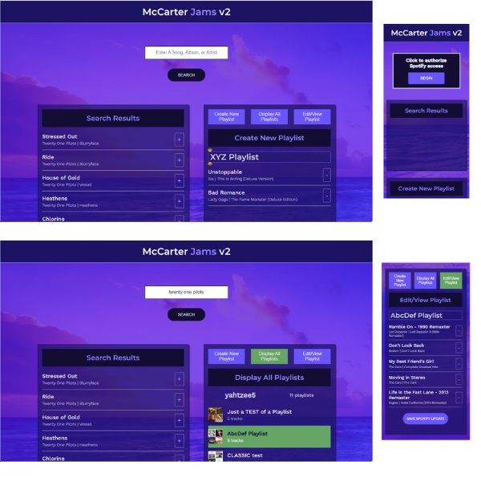

# McCarter Jams v2  
## Music Playlist App that reads from and writes to the Spotify API.  
### Users can search the Spotify library, create a custom playlist, then save it to their Spotify account.  
### With version 2, users can also review their Spotify playlists, edit them, and save the changes to their Spotify account.  
#### User must sign into Spotify through the App to use it.  
  
The initial form of this project started via Codecademy. I redesigned and adapted, restyled, and expanded it to my liking. It can now be used to build and curate a library of custom playlists for Spotify accounts. I may iterate to a version 3 at some point since it could still use a preview feature and maybe protections for timing out and track count limits.  
  
**The first UPDATE: I rewrote all the React components**  
They were originally created as class components, but I replaced them with function components.  
So, it now uses the State Hook to manage state. All classes, constructors with bindings and 'this' keywords were all removed. The methods were rewritten and ones that managed states with compound types were reformulated to merge previous data.  
  
The original styling wasn't right, so I recreated that as well.  
  
It does use Implicit Grant Flow upon authentication and access tokens issued are short-lived.  
*This is a recognized security flaw as it does not involve storing secret keys.*  
  
**v1.1 UPDATE: I redesigned the initial login**  
In the original design the user had to click Search *twice* initially to get started.  
I designed a separate component for the initial access token so it doesn't confuse the user.  
Now when the user sees a search bar, they have already established access and can search.  
  
It is deployed with surge and available online at https://mccarterjams.surge.sh  
I had to be sure to copy the index.html to 200.html in the build directory for surge to work.  
Also the redirect URI after API authorization had to be correct, in both the application utility  
and the API developer settings.  
I added "homepage": "." to the package.json so CRA knows the correct root path.  
  
**v2.0 UPDATE: I tripled the functionality of the playlist panel**  
The playlist panel now does three functions effectively independently of each other.  
The user can select between building a new playlist from searches, reviewing all of their playlists, and viewing and/or editing any selected existing playlist from their list of playlists. This enables the user to add/remove tracks or rename any of their playlists in real time to their liking at the moment. This way the user can organize and adapt their collection as they build on it.  
  
  
  